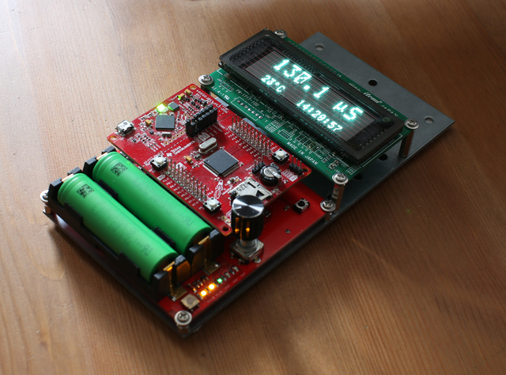
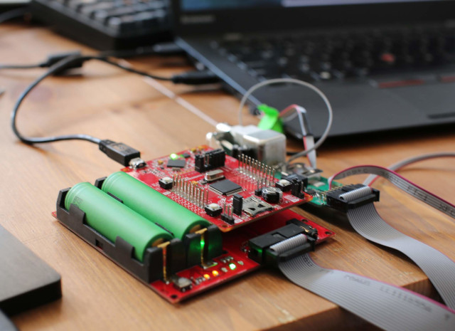

## proto430

 ////// UNDER DEVELOPMENT ///////////////////////

 BoosterPack-compatible development boards used for quick prototyping and interfacing with i2c/spi/uart-based devices



```
 source:       https://github.com/rodan/proto430
 author:       Petre Rodan <2b4eda@subdimension.ro>
 license:      BSD
```



### Components

Collection of plug-in Booster-Pack PCBs compatible with the Texas Instruments LaunchPad development ecosystem. one board provides access to any 3v3 device via a serial interface, the other brings access to a graphical VFD display, a rotary encoder and also has infrared remote input. the two will be linked via i2c or spi.

project directory structure

 * ./hardware/display.* - eagle-based schematics and pcbs for the spi-based Noritake VFD 
 * ./hardware/sensor.*  - eagle-based schematics and pcbs for the i2c/spi/uart devboard
 * ./hardware/vfd.* - firmware for the display pcb

testing is done with MSP-EXP430FR5994 development kits

### Build requirements

you will need TI's excelent [GCC toolchain](https://www.ti.com/tool/MSP430-GCC-OPENSOURCE) or Code Composer Studio for linux and my [reference libraries for msp430 micros](https://github.com/rodan/atlas430) cloned in /opt/.

```
cd ./firmware
make
make install
```

the devboard has been modified by adding a 16MHz high frequency crystal and two load capacitors. if these components are missing from your board then make sure to disable the *USE_XT2* define from the Makefile or CCS.


